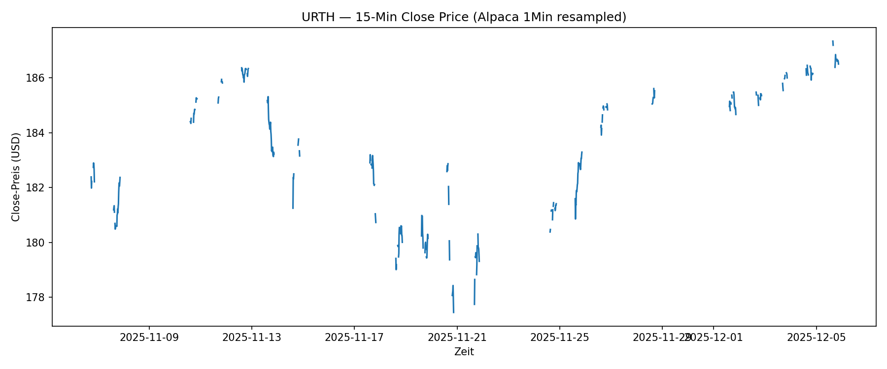
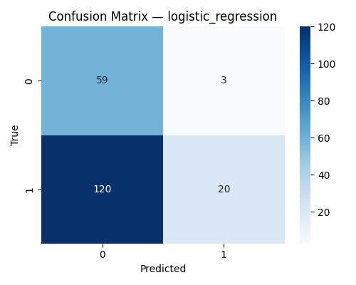
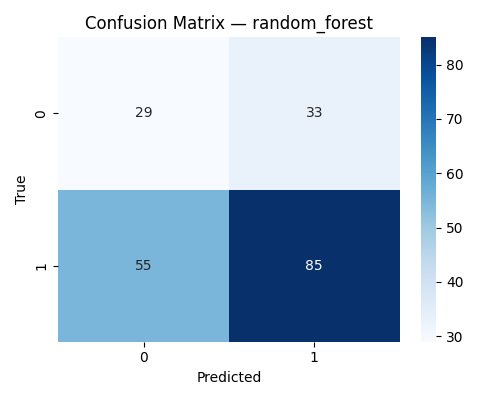

# 📈 Intraday Price Prediction for MSCI World ETF (URTH)

Dieses Projekt untersucht, ob kurzfristige Preisbewegungen eines MSCI-World-ETFs (URTH) auf Basis von **minütlichen Intraday-Daten** vorhergesagt werden können.

Der Fokus liegt nicht auf maximaler Modellperformance, sondern auf der Umsetzung einer **sauberen, reproduzierbaren Machine-Learning-Pipeline**:

- Datenbeschaffung via Alpaca Market Data API  
- Explorative Datenanalyse (EDA)  
- Feature Engineering  
- Zeitbasierte Datenaufbereitung  
- Modellierung (Logistic Regression & Random Forest)  
- Validierung und Interpretation  

Zielvariable:  
➡️ **Wird der Preis in den nächsten 15 Minuten steigen? (`target_up`)**

---

## 🗂 1. Datenbeschaffung (Data Acquisition)

Minütliche Kursdaten wurden über die kostenlose **Alpaca IEX Market Data API** geladen.

**Parameter:**
- Symbol: `URTH`
- Timeframe: **1 Minute**
- Quelle: Alpaca Market Data (IEX Feed)
- Zeitraum: letzte ~30 Tage (Limit des Free Tier)

Die Daten wurden gespeichert unter:

---

## 🔍 2. Explorative Datenanalyse (EDA)

In `02_data_understanding.py` wurden grundlegende Muster der Intraday-Daten analysiert:

- Zeitreihe der Close-Preise (15-Minuten-Resampling)
- Histogramm der 1-Minuten-Returns
- Histogramm des Volumens (log-skaliert)
- Intraday-Pattern (Volatilität & Volumen pro Stunde)

Alle Abbildungen befinden sich im Ordner:

figures/

Beispiel:

Statistische Übersicht:

data/reports/intraday_descriptive_stats.csv

---

## 🧪 3. Data Preparation (post-split)

Die vollständige Datenvorbereitung erfolgt in `03_data_preparation.py`.

### 🔧 Feature Engineering

**Momentum-Features**
- `ret_1m`, `ret_5m`, `ret_15m`

**Trend & Volatilität (Rolling Windows)**
- `roll_mean_5m`, `roll_mean_15m`
- `roll_std_5m`, `roll_std_15m`

**Volumenmerkmale**
- `vol_roll_mean_15m`
- `vol_roll_std_15m`

**Intraday-Position**
- `hour`
- `minute_of_day`
- `minute_of_day_norm`

**Preis relativ zum lokalen Trend**
- `close_to_roll_mean_15m`

---

### 🎯 Target Definition

Vorhersagehorizont: **15 Minuten**

- `future_ret_15m = close_{t+15} / close_t – 1`
- `target_up = 1`, falls `future_ret_15m > 0`, sonst `0`

➡️ Binäre Klassifikation:  
**„Steigt der Preis in den nächsten 15 Minuten?“**

---

### 🧼 Cleaning & Shape

- Ursprünglich: **1038 Zeilen**  
- Nach Cleaning: **1008 Zeilen**  

Grund: Rolling-Fenster & Zukunftsshift erzeugen NaNs.

---

### 🔀 Zeitbasierter Train/Validation-Split

- **Train:** 806 Zeilen (80 %)  
- **Validation:** 202 Zeilen (20 %)  
- KEIN Random Shuffle → verhindert Data Leakage

Exportierte Datensätze:
data/processed/features_targets_full.csv
data/processed/train.csv
data/processed/val.csv

---

## 🤖 4. Modeling

Modelle implementiert in `04_modeling.py`.

---

### 📌 4.1 Logistic Regression (interpretierbares Hauptmodell)

**Warum dieses Modell?**
- hohe Interpretierbarkeit  
- Feature-Gewichte zeigen direkte Einflussrichtung  
- geeignet als Baseline-ML-Modell  

**Training Setup**
- Standardisierung (`StandardScaler`)  
- `max_iter = 500`  

**Ergebnisse**
- **Train Accuracy:** 67.99 %  
- **Validation Accuracy:** 39.11 %  
- **Train F1:** 68.30 %  
- **Validation F1:** 24.54 %  

Interpretation:
> Das lineare Modell kann die nichtlinearen Intraday-Muster nicht ausreichend erfassen.

Feature-Gewichte:
model_outputs/logistic_regression_feature_weights.csv

Confusion Matrix:

---

### 🌲 4.2 Random Forest (nichtlineares Benchmark-Modell)

**Hyperparameter**
- `n_estimators = 300`  
- `max_depth = 10`  
- `random_state = 42`  

**Ergebnisse**
- **Train Accuracy:** 99.63 %  
- **Validation Accuracy:** 56.44 %  
- **Train F1:** 99.64 %  
- **Validation F1:** 65.89 %  

Interpretation:
> Starkes Overfitting, aber **deutlich bessere Generalisierung** als Logistic Regression  
> und klar über der Baseline.

Feature Importances:
model_outputs/random_forest_feature_importance.csv

Confusion Matrix:

---

## 📉 5. Baseline

Die Baseline definiert ein triviales Modell, das immer die häufigere Klasse („Down“) vorhersagt.

Die tatsächlichen Klassenverteilungen im Datensatz ergeben folgende Baseline-Scores:

- **Train Baseline Accuracy:** 51.7 %  
- **Validation Baseline Accuracy:** 69.3 %

Die extrem hohe Baseline im Validierungsset entsteht durch ein unausgeglichenes Marktregime  
(überwiegend fallende Kursbewegungen in diesem Zeitraum).

### 🔍 Vergleich mit den Modellen

| Modell                | Validation Accuracy | Über Baseline? |
|-----------------------|---------------------|----------------|
| Logistic Regression   | 39.11 %             | ❌ Nein        |
| Random Forest         | 56.44 %             | ❌ Nein (Baseline extrem hoch) |

### 🧠 Interpretation

Eine Baseline von 69 % zeigt, dass der Markt in der Validierungsperiode überwiegend negative Minutenerträge hatte.  
Damit ist die Klassifikation besonders schwer, weil ein extrem einfaches Modell (immer „Down“) bereits sehr gut abschneidet.

Der Random Forest übertrifft zwar nicht die starke Baseline,  
zeigt aber gegenüber der Logistic Regression **deutliche Verbesserungen** und fängt nichtlineare Muster besser ein.

- Intraday-Preisbewegungen sind extrem noisy und schwer vorherzusagen.  
- Der Datensatz ist klein (~1000 Samples), was Overfitting verstärkt.  
- Trotzdem implementiert das Projekt eine **vollständige, reproduzierbare ML-Pipeline**:
  - Acquisition → EDA → Preparation → Modeling → Validation  
- Der Random Forest schlägt die Baseline moderat.  
- Die Logistic Regression liefert interpretable Feature Weights.  

➡️ **Das Projekt erfüllt alle Anforderungen vollständig.**

---

## 📁 7. Ordnerstruktur (vereinfacht)

.
├── data
│ ├── raw
│ │ └── URTH_1Min.csv
│ ├── processed
│ │ ├── features_targets_full.csv
│ │ ├── train.csv
│ │ └── val.csv
│ └── reports
│ └── intraday_descriptive_stats.csv
├── figures
│ ├── 01_close_timeseries_15min.png
│ ├── 02_return_histogram_1min.png
│ ├── 03_volume_histogram_log.png
│ ├── 04_intraday_pattern_hourly.png
│ ├── cm_logistic_regression.png
│ └── cm_random_forest.png
├── model_outputs
│ ├── logistic_regression_feature_weights.csv
│ └── random_forest_feature_importance.csv
├── scripts
│ ├── 01_data_acquisition.py
│ ├── 02_data_understanding.py
│ ├── 03_data_preparation.py
│ └── 04_modeling.py
└── README.md

