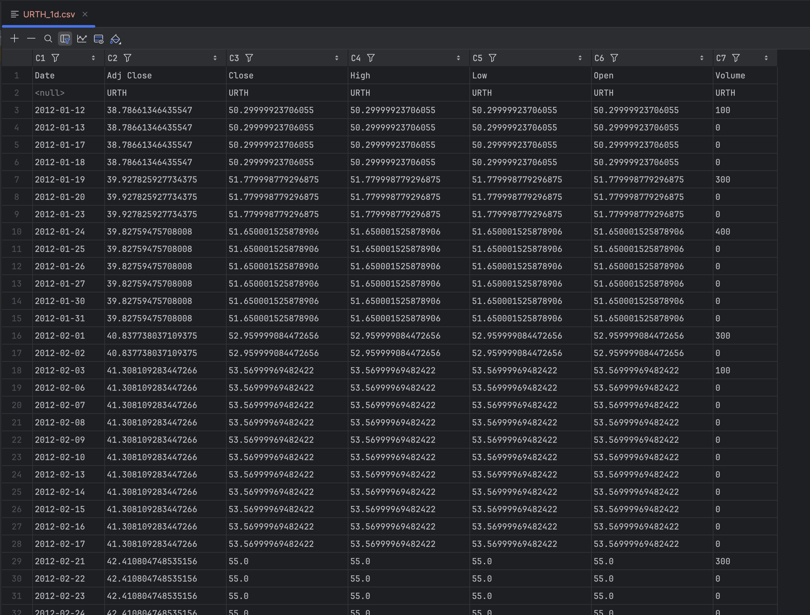

# Experiment 1.1 — Problem Definition & Data Acquisition

## 1. Problem Definition

Wir möchten ein Modell entwickeln, das vorhersagt, ob der MSCI World ETF (URTH) am nächsten Handelstag steigen oder fallen wird.  
Die Vorhersage soll später für eine einfache, regelbasierte Trading-Strategie genutzt und per Backtesting evaluiert werden.

### Target Variable

Für jeden Handelstag t definieren wir:

target(t) = 1, wenn Close(t+1) > Close(t)
target(t) = 0, sonst

Interpretation:
- 1 = Der ETF steigt am nächsten Tag  
- 0 = Der ETF fällt oder bleibt gleich  

→ Das Problem ist eine binäre Klassifikation.

### Input-Variablen (Rohdaten)

Wir verwenden End-of-Day-Daten (EOD):

- Date  
- Open  
- High  
- Low  
- Close  
- Adj Close  
- Volume  

Später werden zusätzliche Features erstellt (z. B. Renditen, MAs, Volatilität, RSI, MACD).

### Baseline

- Buy & Hold (immer investiert sein)

---

## 2. Data Acquisition

### Datenquelle & API

- Quelle: Yahoo Finance
- API/Bibliothek: yfinance
- ETF: URTH (iShares MSCI World ETF)
- Intervall: 1 Tag (1d)
- Zeitraum: ab 2010-01-01

### Download-Prozess (Python)

python
import yfinance as yf

df = yf.download(
    "URTH",
    start="2010-01-01",
    interval="1d",
    progress=False
)

df.to_csv("data/raw/URTH_1d.csv")

### Speicherung

- Pfad: data/raw/URTH_1d.csv
- Format: CSV (UTF‑8, Header)

### Rohdaten-Beispiel
